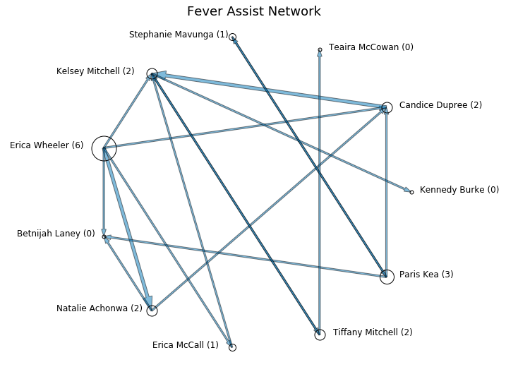
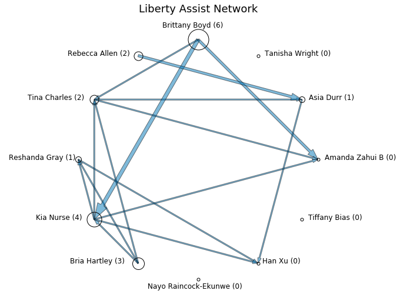
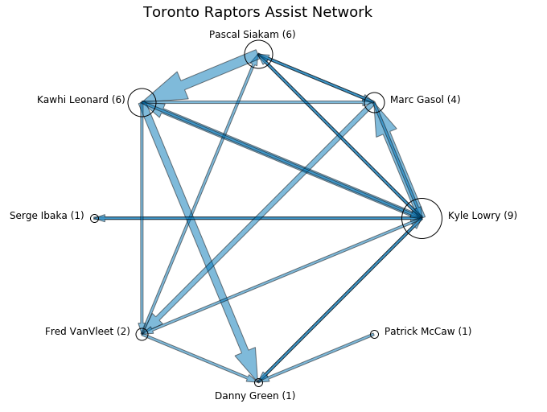

# assist_networks
Visualizing team assists as a network of player nodes

## Results

### WNBA

The following shows assist networks for a 6/1/19 contest between the New York Liberty and the Indiana Fever.

 

Erica Wheeler of the Fever and Brittany Boyd of the Liberty led the game with six assists each. 

### NBA

The following shows assist networks for the 6/5/19 NBA Finals contest between the Toronto Raptors and the Golden State Warriors.

The Raptors had 30 assists, nine of which came from Kyle Lowry.
